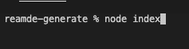

  # reamde-generate

  

  ## Description 
  A README generator built in node with inquirer.

  ## Table of Contents
  * [Installation](#installation)
  * [Usage](#usage)
  * [License](#license)
  * [Contributing](#contributing)
  * [Tests](#tests)
  * [Questions](#questions)
  
  ## Installation
  ~~~
  npm i
  ~~~
  ## Usage
  
  Make sure to get the dependancies by running ```npm i```. Then to run the program, run ```node index```. 

   

  Look for your completed readme in the dist folder.

  
  
  ## License

  

  ## Contributing

  Free to contribute as you see fit! 

  ## Tests
  ~~~
  npm test
  ~~~
  ## Questions

  Contact me at madalyne@madalynecross.com with any questions. View more of my work here: [violanerd](https://github.com/violanerd).

